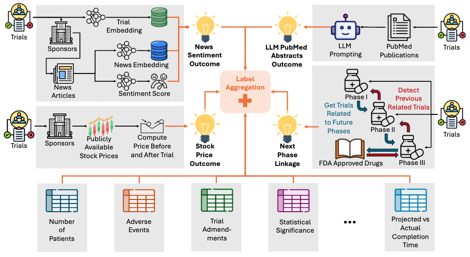

<p align="center"></p>

# CTO

Code for CTO: A Large Clinical Trial Outcome 

[Paper Link: Automatically Labeling $200B Life-Saving Datasets: A Large Clinical Trial Outcome Benchmark](https://arxiv.org/abs/2406.10292)

[Dataset Link](https://zenodo.org/doi/10.5281/zenodo.11535960)

Please see the following modules for implementations of each of the following sources of weakly supervised labelling functions.

#### [llm_prediction_on_pubmed](https://github.com/chufangao/CTOD/tree/main/llm_prediction_on_pubmed)
PubMed abstracts have been automatically linked to clinical trials by initiatives such as the Clinical Trials Transformation Initiative (CTTI). We focuse only on the Derived and Results categories to concentrate on clinical trial outcomes. For trials with multiple abstracts, we selected the top two based on their title similarity to the trial's official title to ensure relevance.
Using these abstracts, we prompted the gpt-3.5 model to summarize important trial-related statistical tests and predict the outcomes. Additionally, we had the model generate QA pairs about the trials, which are included as a supplement to our benchmark. The prompts used for these tasks are provided in the paper.

#### [clinical_trial_linkage](https://github.com/chufangao/CTOD/tree/main/clinical_trial_linkage)
The journey from drug discovery to FDA approval involves several stages, starting with Phase 1 trials for safety and dosage, followed by Phase 2 and 3 trials to evaluate efficacy and compare with existing therapies. After Phase 3, a drug may be submitted for FDA approval. This linkage is difficult due to unstructured data, inconsistent reporting, and discrepancies in intervention details. Despite these challenges, linking trials is invaluable for clinical trial outcome predictions. We present a novel trial-linking algorithm, the first systematic attempt to connect different phases of clinical trials, involving two steps: linking trials across phases and matching Phase 3 trials with FDA approvals.

#### [news_headlines](https://github.com/chufangao/CTOD/tree/main/news_headlines)
We conducted web scraping, sending requests to Google News for headlines related to the top 1000 industry sponsors, covering approximately 80% of industry-sponsored trials (27,720 trials). Due to rate limits, we queried at a rate of 1 query every 3-5 seconds, collecting up to 100 articles per month from the sponsor's earliest trial to the present, totaling 1,115,017 news articles. We used FinBERT to classify the financial sentiment of these headlines as 'Positive' or 'Negative,' discarding 'Neutral' sentiments. For news/trial matching, we filtered and reranked headlines using a top-K retriever and cross-encoder, encoding trials and headlines with PubMedBERT and calculating relevancy scores. 

#### [stock_price](https://github.com/chufangao/CTOD/tree/main/stock_price)
The stock price of pharmaceutical and biotech companies often reflects market expectations about clinical trial outcomes. Positive expectations can lead to a stock rise, while low expectations or past failures may result in poor performance. We used Yahoo Finance to gather historical stock data for companies with publicly available tickers for completed trials. By calculating a 5-day simple moving average (SMA) of stock prices, we smoothed out short-term fluctuations to highlight underlying trends. The slope of the SMA over a 7-day window from the trial's completion date indicates the trend's direction and steepness, capturing the immediate impact of trial completions.

#### [labeling](https://github.com/chufangao/CTOD/tree/main/stock_price)
For Phases 1, 2, and 3, we determine specific quantile thresholds from a range of values for all tunable labeling functions (LFs), fine-tuning each on the TOP training dataset. Our final labeling process employs both an unsupervised data programming approach and a supervised Random Forest model to estimate labels and align weakly supervised signals with the human-annotated TOP training data. In data programming, we incorporate TOP training labels with other weakly supervised LFs. For the supervised approach, we train a Random Forest model using other weakly supervised LF outputs. 

Additionally, [lfs.py](https://github.com/chufangao/CTOD/blob/main/labeling/lfs.py) contains LFs computed from clinical trial metrics, such as status, number of adverse events, number of admenments, etc.


## Reference
```bash
@article{gao2024automatically,
  title={Automatically Labeling $200 B Life-Saving Datasets: A Large Clinical Trial Outcome Benchmark},
  author={Gao, Chufan and Pradeepkumar, Jathurshan and Das, Trisha and Thati, Shivashankar and Sun, Jimeng},
  journal={arXiv preprint arXiv:2406.10292},
  year={2024}
}
```    
[](https://choosealicense.com/licenses/mit/)

[](https://doi.org/10.5281/zenodo.11535960)


### Authors

- [@chufangao](https://www.github.com/chufangao)
- [@Jathurshan0330](https://www.github.com/Jathurshan0330)
- [@trishad2](https://www.github.com/trishad2)
