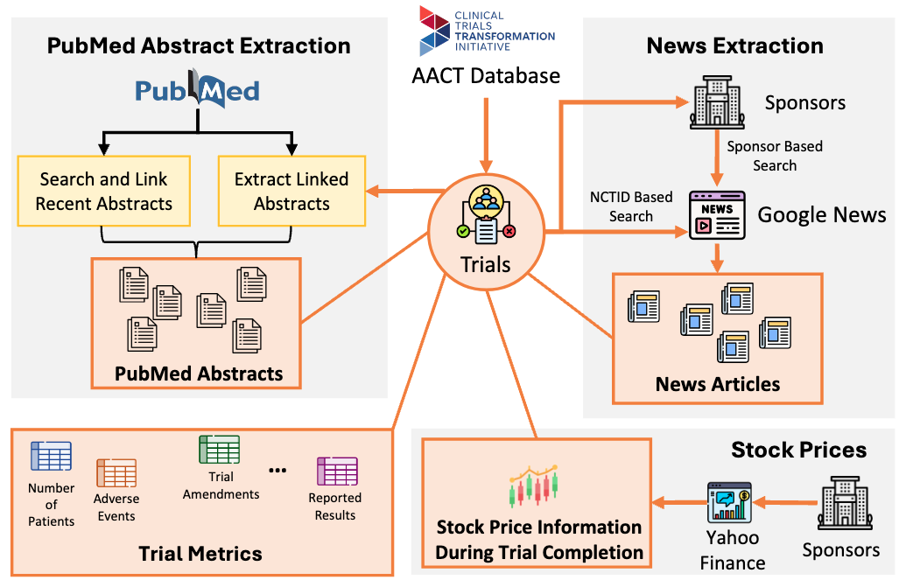

<p align="center"></p>

# CTOD: Clinical Trial Outcome Detection


Code for **Automatically Labeling Clinical Trial Outcomes: A Large-Scale Benchmark for Drug Development**

## 🔗 Quick Links

- 🌐 **[Project Website](https://chufangao.github.io/CTOD/)**
- 📄 **[Research Paper (ArXiv)](https://arxiv.org/abs/2406.10292)**
- 🤗 **[Dataset on Hugging Face](https://huggingface.co/datasets/chufangao/CTO)**
- 📚 **[Tutorials & Google Colab Notebooks](https://github.com/chufangao/CTOD/tree/main/tutorials)**
- 🏷️ **[DOI: 10.57967/hf/4597](https://doi.org/10.57967/hf/4597)**

## 📋 Table of Contents

- [Overview](#overview)
- [🚀 Quick Start](#-quick-start)
- [📦 Installation](#-installation)
- [🏗️ Project Structure](#️-project-structure)
- [📖 Modules](#-modules)
- [💻 Usage Examples](#-usage-examples)
- [🔧 Development](#-development)
- [📚 Documentation](#-documentation)
- [📊 Citation](#-citation)
- [👥 Authors](#-authors)
- [🙏 Acknowledgments](#-acknowledgments)
- [❓ FAQ & Troubleshooting](#-faq--troubleshooting)

## Overview

The Clinical Trial Outcome Detection (CTOD) project provides a comprehensive benchmark for automatically labeling clinical trial outcomes using weakly supervised learning. This repository implements various sources of labeling functions that can predict clinical trial success or failure based on diverse data sources.

### Key Features

- 🔬 **Multi-source weak supervision**: Leverage PubMed abstracts, clinical trial linkages, news headlines, and stock prices
- 📊 **Large-scale benchmark**: Comprehensive evaluation framework for drug development predictions
- 🤖 **LLM integration**: GPT-3.5 based predictions on medical literature
- 📈 **Financial sentiment analysis**: Stock price trends and news sentiment correlation
- 🔗 **Cross-phase linkage**: Connect trials across different development phases

## 🚀 Quick Start

**Want to get started immediately?** Use our Google Colab notebooks:

[](https://colab.research.google.com/github/chufangao/CTOD/blob/main/tutorials/getting_started_cto_vs_top.ipynb) **Recommended for beginners**

[](https://colab.research.google.com/github/chufangao/CTOD/blob/main/tutorials/full_experiments.ipynb) **For comprehensive exploration**

## 📦 Installation

### System Requirements

- Python 3.7 or higher
- 8GB+ RAM recommended
- GPU support recommended for large-scale experiments

### Basic Installation

1. **Clone the repository:**
   ```bash
   git clone https://github.com/chufangao/CTOD.git
   cd CTOD
   ```

2. **Install dependencies:**
   ```bash
   pip install -r requirements.txt
   ```

3. **Download required datasets:**
   ```bash
   # Download CTTI data
   python download_ctti.py
   
   # Or use the full pipeline
   bash pipeline.sh
   ```

### For Development

If you plan to contribute or modify the code:

```bash
# Install in development mode
pip install -e .

# Install additional development dependencies
pip install jupyter matplotlib seaborn
```

## 🏗️ Project Structure

```
CTOD/
├── 📁 baselines/              # Baseline models (BERT, SVM, XGBoost, etc.)
├── 📁 clinical_trial_linkage/ # Cross-phase trial linking algorithms
├── 📁 llm_prediction_on_pubmed/ # LLM-based predictions on PubMed abstracts
├── 📁 news_headlines/         # News sentiment analysis for trial outcomes
├── 📁 stock_price/           # Stock price trend analysis
├── 📁 labeling/              # Label generation and weak supervision
├── 📁 tutorials/             # Jupyter notebooks and tutorials
├── 📄 README.md              # This file
├── 📄 requirements.txt       # Python dependencies
├── 📄 pipeline.sh           # Complete pipeline execution script
└── 📄 index.html            # Project website
```

## 📖 Modules

This repository provides implementations for various sources of weakly supervised labeling functions (LFs) used in the CTO benchmark. Each module corresponds to a different data source and approach for generating weak labels:

### 🧠 [LLM Prediction on PubMed](./llm_prediction_on_pubmed/)
Leverages PubMed abstracts linked to clinical trials using GPT-3.5 for outcome prediction.

**Key Features:**
- Prioritizes top 2 abstracts based on title similarity
- Uses carefully designed prompts for outcome prediction
- Processes Derived and Results category abstracts

**Quick Usage:**
```bash
cd llm_prediction_on_pubmed
python extract_pubmed_abstracts.py --data_path <CTTI_PATH> --NCBI_api_key <API_KEY>
python get_llm_predictions.py --top_2_pubmed_path <PATH> --save_path <SAVE_PATH>
```

### 🔗 [Clinical Trial Linkage](./clinical_trial_linkage/)
Links clinical trials across phases (1, 2, 3) and connects them to FDA approvals.

**Key Features:**
- Connects trials across different development phases
- Matches Phase 3 trials with FDA approvals
- Uses reranking method for improved relevance

**Quick Usage:**
```bash
cd clinical_trial_linkage
python extract_trial_info.py --data_path <CTTI_PATH>
python create_trial_linkage.py --target_phase 'Phase 3' --save_path <PATH>
```

### 📰 [News Headlines](./news_headlines/)
Analyzes news sentiment using headlines from top pharmaceutical sponsors.

**Key Features:**
- Web scraping from Google News using SerpAPI
- FinBERT sentiment classification
- Covers top 1000 industry sponsors (~80% of trials)

**Quick Usage:**
```bash
cd news_headlines
python get_news.py --mode=get_news
python get_news.py --mode=process_news
```

### 📈 [Stock Price Analysis](./stock_price/)
Correlates stock price fluctuations with clinical trial outcomes.

**Key Features:**
- Historical stock data from Yahoo Finance
- 5-day Simple Moving Average calculation
- 7-day trend slope analysis post-completion

**Quick Usage:**
```bash
cd stock_price
# Follow slope_calculation.ipynb notebook
```

### 🏷️ [Labeling System](./labeling/)
Combines all weak supervision sources into final labels using machine learning.

**Key Features:**
- Random Forest model for label aggregation
- Quantile threshold optimization by trial phase
- Additional clinical trial metrics integration

**Quick Usage:**
```bash
cd labeling
# See create_labels.ipynb for complete workflow
python lfs.py  # Run labeling functions
```

### 🎯 [Baselines](./baselines/)
Implements various baseline models for comparison and evaluation.

**Supported Models:**
- BioBERT, PubMedBERT
- SVM, XGBoost, MLP, Random Forest, Logistic Regression
- SPOT (specialized clinical trial model)

**Quick Usage:**
```bash
cd baselines
python baselines.py  # Run classical ML models
python biobert_trial_outcome.py  # Run BERT-based models
```

## 💻 Usage Examples

### Basic Pipeline Execution

Run the complete pipeline:

```bash
# Set your data paths
export DATA_PATH=/path/to/CTTI/data
export SAVE_PATH=/path/to/save/results

# Execute full pipeline
bash pipeline.sh
```

### Individual Module Usage

**Predict outcomes for new trials:**
```python
from labeling.lfs import predict_trial_outcome
from clinical_trial_linkage.support_functions import extract_study_basic_info

# Load trial data
trial_info = extract_study_basic_info(data_path)

# Get predictions
predictions = predict_trial_outcome(trial_info)
```

**Analyze trial linkages:**
```python
from clinical_trial_linkage.trial_linkage_utils import find_linked_trials

# Find related trials across phases
linked_trials = find_linked_trials(phase2_trial, target_phase='Phase 3')
```

## 🔧 Development

### Running Tests

```bash
# Run existing test notebooks
jupyter notebook labeling/hint_test.ipynb
jupyter notebook baselines/hint_test.ipynb
```

### Contributing

See [CONTRIBUTING.md](./CONTRIBUTING.md) for detailed contribution guidelines.

### API Keys Required

- **NCBI API Key**: For PubMed abstract extraction
- **OpenAI API Key**: For LLM predictions
- **SerpAPI Key**: For news headline scraping (optional)

Store these in a `.env` file:
```
NCBI_API_KEY=your_ncbi_key
OPENAI_API_KEY=your_openai_key
SERPAPI_KEY=your_serpapi_key
```

## 📚 Documentation

For comprehensive documentation, visit our **[docs directory](./docs/)**:

- **[📦 Installation Guide](./docs/INSTALLATION.md)** - Complete setup instructions
- **[🔧 API Reference](./docs/API.md)** - Function and class documentation
- **[🏗️ Architecture Overview](./docs/ARCHITECTURE.md)** - System design and components
- **[📊 Data Documentation](./docs/DATA.md)** - Dataset descriptions and schemas
- **[📋 Documentation Index](./docs/README.md)** - Navigate all documentation 

## 📊 Citation

If you use this work in your research, please cite our paper:

```bibtex
@article{gao2024automatically,
  title={Automatically Labeling Clinical Trial Outcomes: A Large-Scale Benchmark for Drug Development},
  author={Gao, Chufan and Pradeepkumar, Jathurshan and Das, Trisha and Thati, Shivashankar and Sun, Jimeng},
  journal={arXiv preprint arXiv:2406.10292},
  year={2024}
}
```

## 👥 Authors

- **[@chufangao](https://www.github.com/chufangao)** - Lead Developer
- **[@Jathurshan0330](https://www.github.com/Jathurshan0330)** - Core Contributor  
- **[@trishad2](https://www.github.com/trishad2)** - Core Contributor

## 🙏 Acknowledgments

We extend our gratitude to:

- **[SerpApi](https://serpapi.com/)** for their powerful search API that enabled scalable clinical trial news gathering across 80,000+ trials
- **CTTI (Clinical Trials Transformation Initiative)** for providing comprehensive clinical trial data
- **FDA** for public access to the Orange Book database
- **PubMed/NCBI** for medical literature access

## ❓ FAQ & Troubleshooting

### Common Issues

**Q: Installation fails with dependency conflicts**
```bash
# Use conda environment for better dependency management
conda create -n ctod python=3.8
conda activate ctod
pip install -r requirements.txt
```

**Q: CTTI download fails**
- Check your internet connection
- Try downloading manually from [CTTI website](https://aact.ctti-clinicaltrials.org/download)
- Ensure you have sufficient disk space (>10GB)

**Q: OpenAI API errors**
- Verify your API key is valid and has sufficient credits
- Check rate limits if getting timeout errors
- Use Azure OpenAI as alternative (see `--azure` flag)

**Q: Memory errors during processing**
- Reduce batch sizes in processing scripts
- Use `--dev` flag for smaller dataset testing
- Consider using machines with more RAM for full dataset

### Getting Help

- 📧 Open an issue on GitHub for bugs or feature requests
- 💬 Check existing issues for similar problems
- 📖 Review module-specific READMEs for detailed instructions

---

[](https://choosealicense.com/licenses/mit/)

