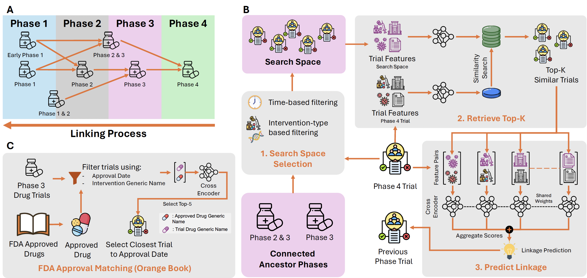

# 🔗 Clinical Trial Linkage Generation

<p align="center">
  
</p>

## Overview

This module addresses the critical challenge of linking clinical trials across different phases (Phase 1, 2, 3) and connecting them to FDA approvals. We systematically connect different phases of clinical trials and match Phase 3 trials with subsequent FDA approvals using advanced text similarity and reranking methods.

## 🔧 Prerequisites

### Required Data Sources

1. **FDA Orange Book**: Download from [FDA website](https://www.fda.gov/media/76860/download?attachment)
   - Save to `./FDA_approvals/` directory
   - Current version: 2024-04 (provided in repository)
   - More info: [FDA Orange Book Data Files](https://www.fda.gov/drugs/drug-approvals-and-databases/orange-book-data-files)

2. **CTTI Clinical Trial Data**: Download from [CTTI website](https://aact.ctti-clinicaltrials.org/download)
   - Pipe-delimited files format
   - Update data paths in scripts accordingly

3. **National Drug Code Directory**: Download from [OpenFDA](https://open.fda.gov/data/downloads/)

4. **DrugBank Database**: Download from [DrugBank](https://go.drugbank.com/releases/latest)
   - Full database for researchers required
   - Used for drug name standardization

### API Keys & Dependencies

```bash
pip install pandas numpy scikit-learn torch transformers sentence-transformers tqdm
```

## 🚀 Quick Start

### Step 1: Prepare Drug Mapping

```bash
cd clinical_trial_linkage

# Process DrugBank database (optional - we provide pre-computed mapping)
python process_drugbank.py --save_path <SAVE_PATH>
python create_drug_mapping.py --save_path <SAVE_PATH>
```

**Note**: We provide the drug mapping dictionary at `drug_mapping.json` for convenience.

### Step 2: Extract Trial Information and Embeddings

```bash
# Extract trial features from CTTI dataset
python extract_trial_info.py --data_path <PATH_TO_CTTI_DATA>

# Generate PubMedBERT embeddings for trials
python get_embedding_for_trial_linkage.py \\
    --root_folder <EMBEDDING_SAVE_PATH> \\
    --num_workers 2 \\
    --gpu_ids 0,1
```

### Step 3: Link Trials Across Phases

Execute linkage for each phase (from later to earlier phases):

```bash
# Phase 4 → Earlier phases
python create_trial_linkage.py \\
    --root_folder <LINKAGE_SAVE_PATH> \\
    --target_phase 'Phase 4' \\
    --embedding_path <EMBEDDING_PATH> \\
    --num_workers 2 \\
    --gpu_ids 0,1

# Phase 3 → Earlier phases
python create_trial_linkage.py \\
    --root_folder <LINKAGE_SAVE_PATH> \\
    --target_phase 'Phase 3' \\
    --embedding_path <EMBEDDING_PATH> \\
    --num_workers 2 \\
    --gpu_ids 0,1

# Phase 2/3 → Earlier phases
python create_trial_linkage.py \\
    --root_folder <LINKAGE_SAVE_PATH> \\
    --target_phase 'Phase 2/Phase 3' \\
    --embedding_path <EMBEDDING_PATH> \\
    --num_workers 2 \\
    --gpu_ids 0,1

# Phase 2 → Phase 1
python create_trial_linkage.py \\
    --root_folder <LINKAGE_SAVE_PATH> \\
    --target_phase 'Phase 2' \\
    --embedding_path <EMBEDDING_PATH> \\
    --num_workers 2 \\
    --gpu_ids 0,1
```

### Step 4: Extract Outcome Labels

```bash
# Generate weak labels from trial linkages
python extract_outcome_from_trial_linkage.py \\
    --trial_linkage_path <PATH_TO_TRIAL_LINKAGES>
```

### Step 5: FDA Approval Matching

```bash
# Match FDA approvals to Phase 3 trials
python match_fda_approvals.py \\
    --trial_linkage_path <TRIAL_LINKAGE_PATH>
```

## 📁 Output Files

The final outcome labels will be saved at:
```
<trial_linkage_path>/outcome_labels/Merged_(ALL)_trial_linkage_outcome_df.csv
```

## 🔬 Algorithm Details

### Linkage Strategy

1. **Text Similarity**: Initial matching using PubMedBERT embeddings
2. **Reranking**: Refine relevance using additional trial features
3. **Cross-validation**: Validate linkages across multiple criteria
4. **FDA Integration**: Connect successful Phase 3 trials to approvals

### Supported Phases

- Phase 1 → Phase 2
- Phase 2 → Phase 3
- Phase 2/Phase 3 → Later phases
- Phase 3 → FDA Approval
- Phase 4 → All earlier phases

## ⚙️ Configuration Options

### Command Line Arguments

| Argument | Description | Default | Required |
|----------|-------------|---------|----------|
| `--data_path` | Path to CTTI data directory | - | Yes |
| `--save_path` | Output directory for results | - | Yes |
| `--target_phase` | Phase to link from | - | Yes |
| `--num_workers` | Number of parallel workers | 1 | No |
| `--gpu_ids` | GPU devices to use | 0 | No |
| `--dev` | Use smaller dataset for testing | False | No |

### Performance Tuning

- **Memory Usage**: Adjust batch sizes in processing scripts
- **Speed**: Increase `num_workers` based on your system
- **GPU Usage**: Specify multiple GPUs with `--gpu_ids 0,1,2,3`

## 🐛 Troubleshooting

**Common Issues:**

1. **Out of Memory**: Reduce batch size or use fewer workers
2. **GPU Errors**: Check CUDA installation and GPU availability
3. **File Not Found**: Verify all data paths are correct
4. **Empty Results**: Check trial phase naming consistency

**Debug Mode:**
```bash
# Run with smaller dataset for testing
python script_name.py --dev
```

## 📊 Expected Processing Times

| Step | Dataset Size | Estimated Time |
|------|-------------|----------------|
| Trial Info Extraction | Full CTTI | 2-4 hours |
| Embedding Generation | Full CTTI | 8-12 hours |
| Phase Linkage (each) | Full CTTI | 4-6 hours |
| FDA Matching | Full CTTI | 1-2 hours |

*Times may vary based on hardware and configuration*
