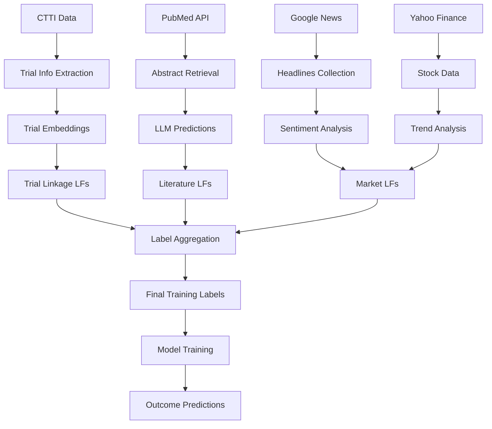

# CTOD Architecture Documentation

## 🏗️ System Architecture Overview

The Clinical Trial Outcome Detection (CTOD) system is designed as a modular, scalable pipeline for weakly supervised learning in clinical trial outcome prediction. This document describes the system architecture, component interactions, and design principles.

## 🔧 Core Components

### 1. Data Ingestion Layer
```
┌─────────────────────────────────────────────────────────┐
│                 Data Ingestion Layer                    │
├─────────────────────────────────────────────────────────┤
│ • CTTI Downloader     • PubMed API Client              │
│ • News Scraper        • Stock Data Client              │
│ • FDA Data Parser     • External API Integrations     │
└─────────────────────────────────────────────────────────┘
```

**Responsibilities:**
- Download and validate external data sources
- Handle API rate limiting and error recovery
- Standardize data formats across sources
- Implement data versioning and tracking

### 2. Feature Engineering Layer
```
┌─────────────────────────────────────────────────────────┐
│               Feature Engineering Layer                 │
├─────────────────────────────────────────────────────────┤
│ • Text Embeddings     • Temporal Features              │
│ • Clinical Metrics    • Market Indicators              │  
│ • Trial Linkages      • Sentiment Analysis             │
└─────────────────────────────────────────────────────────┘
```

**Responsibilities:**
- Transform raw data into machine learning features
- Generate embeddings using domain-specific models
- Extract temporal and sequential patterns
- Compute similarity metrics and linkages

### 3. Weak Supervision Layer
```
┌─────────────────────────────────────────────────────────┐
│               Weak Supervision Layer                    │
├─────────────────────────────────────────────────────────┤
│ • Labeling Functions  • Threshold Optimization         │
│ • Conflict Resolution • Coverage Analysis              │
│ • Label Aggregation   • Quality Assessment             │
└─────────────────────────────────────────────────────────┘
```

**Responsibilities:**
- Implement diverse labeling functions
- Aggregate weak signals into training labels
- Optimize thresholds for different trial phases
- Evaluate label quality and coverage

### 4. Model Training Layer
```
┌─────────────────────────────────────────────────────────┐
│                Model Training Layer                     │
├─────────────────────────────────────────────────────────┤
│ • Baseline Models     • Transformer Models             │
│ • Meta-Learners      • Ensemble Methods                │
│ • Hyperparameter Opt • Cross-Validation               │
└─────────────────────────────────────────────────────────┘
```

**Responsibilities:**
- Train various baseline and advanced models
- Implement ensemble and meta-learning approaches
- Perform hyperparameter optimization
- Conduct comprehensive evaluation

## 🔀 Data Flow Architecture

### Primary Data Flow



### Module Interaction Matrix

| Module | Inputs | Outputs | Dependencies |
|--------|--------|---------|--------------|
| **clinical_trial_linkage** | CTTI studies, FDA data | Trial connections, outcome signals | sentence-transformers, sklearn |
| **llm_prediction_on_pubmed** | CTTI trials, PubMed abstracts | GPT predictions, QA pairs | openai, transformers |
| **news_headlines** | Company names, trial dates | Sentiment scores, relevance matches | finbert, gnews |
| **stock_price** | Company tickers, completion dates | Price trends, volatility signals | yfinance, pandas |
| **labeling** | All module outputs | Aggregated labels, trained meta-models | snorkel, sklearn |
| **baselines** | Features + labels | Model performance, predictions | torch, transformers |

## 🎯 Design Principles

### 1. Modularity
- **Independent Modules**: Each component can run standalone
- **Clear Interfaces**: Standardized input/output formats
- **Loose Coupling**: Minimal dependencies between modules
- **Plugin Architecture**: Easy to add new labeling functions

### 2. Scalability
- **Parallel Processing**: Multi-GPU and multi-worker support
- **Batch Processing**: Efficient handling of large datasets
- **Incremental Updates**: Support for adding new data
- **Resource Management**: Configurable memory and compute usage

### 3. Reproducibility
- **Deterministic Results**: Fixed random seeds and versioning
- **Configuration Management**: YAML-based parameter storage
- **Data Versioning**: Track data sources and processing steps
- **Experiment Tracking**: Log all parameters and results

### 4. Extensibility
- **New Data Sources**: Easy integration of additional sources
- **Custom LFs**: Framework for user-defined labeling functions
- **Model Integration**: Support for new baseline models
- **Evaluation Metrics**: Extensible evaluation framework

## 🔌 API Design

### Core Interfaces

#### Labeling Function Interface
```python
from abc import ABC, abstractmethod

class LabelingFunction(ABC):
    """Abstract base class for all labeling functions."""
    
    @abstractmethod
    def apply(self, trial_data: pd.DataFrame) -> pd.DataFrame:
        """Apply labeling function to trial data."""
        pass
    
    @property
    @abstractmethod
    def name(self) -> str:
        """Return labeling function name."""
        pass
    
    def validate_output(self, labels: pd.DataFrame) -> bool:
        """Validate labeling function output format."""
        required_cols = ['nct_id', 'lf']
        return all(col in labels.columns for col in required_cols)
```

#### Data Processor Interface
```python
class DataProcessor(ABC):
    """Abstract base class for data processing components."""
    
    @abstractmethod
    def process(self, input_data: Any) -> Any:
        """Process input data and return results."""
        pass
    
    @abstractmethod
    def validate_input(self, input_data: Any) -> bool:
        """Validate input data format."""
        pass
    
    def save_results(self, results: Any, save_path: str) -> None:
        """Save processing results to specified path."""
        pass
```

### Configuration Management

```python
class CTODConfig:
    """Centralized configuration management."""
    
    def __init__(self, config_path: str = None):
        self.config = self.load_config(config_path)
    
    def load_config(self, config_path: str) -> dict:
        """Load configuration from YAML file."""
        pass
    
    def get_data_path(self, source: str) -> str:
        """Get data path for specified source."""
        return self.config['data_paths'][source]
    
    def get_api_key(self, service: str) -> str:
        """Get API key for specified service."""
        return os.getenv(self.config['api_keys'][service])
```

## 🚀 Performance Architecture

### Computational Requirements

#### Memory Usage by Module

| Module | Peak Memory | Recommended | Scalability |
|--------|-------------|-------------|-------------|
| **clinical_trial_linkage** | 8-16GB | 32GB | Linear with trials |
| **llm_prediction_on_pubmed** | 4-8GB | 16GB | Linear with abstracts |
| **news_headlines** | 2-4GB | 8GB | Linear with headlines |
| **stock_price** | 1-2GB | 4GB | Linear with tickers |
| **labeling** | 4-8GB | 16GB | Linear with LF outputs |
| **baselines** | 8-32GB | 64GB | Quadratic with features |

#### Processing Time Estimates

```python
# Estimated processing times for full dataset
processing_times = {
    'data_download': '2-4 hours',
    'feature_extraction': '8-16 hours', 
    'embedding_generation': '12-24 hours',
    'trial_linkage': '16-32 hours',
    'llm_predictions': '24-48 hours',
    'label_aggregation': '2-4 hours',
    'model_training': '4-12 hours'
}
```

### Optimization Strategies

#### Parallel Processing
```python
# Multi-GPU processing example
def distribute_across_gpus(data, gpu_ids):
    """Distribute processing across multiple GPUs."""
    
    chunk_size = len(data) // len(gpu_ids)
    processes = []
    
    for i, gpu_id in enumerate(gpu_ids):
        start_idx = i * chunk_size
        end_idx = start_idx + chunk_size if i < len(gpu_ids)-1 else len(data)
        
        chunk = data[start_idx:end_idx]
        process = Process(target=process_chunk_on_gpu, 
                         args=(chunk, gpu_id))
        processes.append(process)
        process.start()
    
    # Wait for completion
    for process in processes:
        process.join()
```

#### Caching Strategy
```python
from functools import lru_cache
import pickle

class EmbeddingCache:
    """Cache for expensive embedding computations."""
    
    def __init__(self, cache_dir: str):
        self.cache_dir = cache_dir
        os.makedirs(cache_dir, exist_ok=True)
    
    def get_embedding(self, text: str, model_name: str) -> np.ndarray:
        """Get embedding with caching."""
        cache_key = f"{hash(text)}_{model_name}.pkl"
        cache_path = os.path.join(self.cache_dir, cache_key)
        
        if os.path.exists(cache_path):
            with open(cache_path, 'rb') as f:
                return pickle.load(f)
        
        # Compute embedding
        embedding = compute_embedding(text, model_name)
        
        # Cache result
        with open(cache_path, 'wb') as f:
            pickle.dump(embedding, f)
        
        return embedding
```

## 🔒 Security Architecture

### API Key Management
- **Environment Variables**: Store keys in environment, not code
- **Key Rotation**: Regular rotation of API keys
- **Access Control**: Limit API key permissions where possible
- **Monitoring**: Track API usage and costs

### Data Security
- **Local Storage**: Secure file permissions on sensitive data
- **Transmission**: HTTPS for all API communications
- **Validation**: Input sanitization and validation
- **Logging**: Secure logging without exposing secrets

## 🧪 Testing Architecture

### Testing Strategy

```python
# Testing hierarchy
testing_levels = {
    'unit_tests': {
        'scope': 'Individual functions',
        'tools': 'pytest, unittest',
        'coverage': '80%+ target'
    },
    'integration_tests': {
        'scope': 'Module interactions', 
        'tools': 'pytest, mock APIs',
        'coverage': 'Critical paths'
    },
    'end_to_end_tests': {
        'scope': 'Complete pipeline',
        'tools': 'Sample datasets',
        'coverage': 'Full workflow'
    },
    'performance_tests': {
        'scope': 'Scalability limits',
        'tools': 'profiling, benchmarks', 
        'coverage': 'Resource bottlenecks'
    }
}
```

### Test Data Management

```python
# Test data organization
test_data_structure = {
    'unit_tests': {
        'size': 'Small (100s of records)',
        'purpose': 'Function validation',
        'location': 'tests/fixtures/'
    },
    'integration_tests': {
        'size': 'Medium (1000s of records)', 
        'purpose': 'Module interaction testing',
        'location': 'tests/data/'
    },
    'performance_tests': {
        'size': 'Large (subset of full data)',
        'purpose': 'Scalability validation',
        'location': 'tests/performance_data/'
    }
}
```

## 📈 Monitoring and Observability

### Key Metrics to Monitor

```python
# System health metrics
monitoring_metrics = {
    'data_quality': [
        'missing_data_percentage',
        'duplicate_records_count', 
        'data_freshness_hours',
        'validation_error_rate'
    ],
    'processing_performance': [
        'processing_time_per_trial',
        'memory_usage_peak',
        'gpu_utilization',
        'api_call_success_rate'
    ],
    'model_performance': [
        'label_coverage_percentage',
        'label_agreement_score',
        'prediction_confidence',
        'model_accuracy_by_phase'
    ],
    'system_health': [
        'disk_space_available',
        'api_quota_remaining',
        'error_rate',
        'uptime_percentage'
    ]
}
```

### Logging Strategy

```python
import logging
from datetime import datetime

class CTODLogger:
    """Centralized logging for CTOD system."""
    
    def __init__(self, module_name: str):
        self.logger = logging.getLogger(f"ctod.{module_name}")
        self.setup_handlers()
    
    def setup_handlers(self):
        """Configure logging handlers."""
        
        # Console handler
        console_handler = logging.StreamHandler()
        console_format = logging.Formatter(
            '%(asctime)s - %(name)s - %(levelname)s - %(message)s'
        )
        console_handler.setFormatter(console_format)
        
        # File handler
        file_handler = logging.FileHandler(
            f'logs/ctod_{datetime.now().strftime("%Y%m%d")}.log'
        )
        file_handler.setFormatter(console_format)
        
        self.logger.addHandler(console_handler)
        self.logger.addHandler(file_handler)
        self.logger.setLevel(logging.INFO)
    
    def log_processing_start(self, component: str, data_size: int):
        """Log start of processing component."""
        self.logger.info(f"Starting {component} processing for {data_size} records")
    
    def log_processing_end(self, component: str, success_count: int, total_count: int):
        """Log completion of processing component."""
        success_rate = success_count / total_count * 100
        self.logger.info(f"Completed {component}: {success_count}/{total_count} ({success_rate:.1f}%) successful")
```

## 🔄 Workflow Orchestration

### Pipeline Execution Flow

```python
class CTODPipeline:
    """Main pipeline orchestrator."""
    
    def __init__(self, config_path: str):
        self.config = CTODConfig(config_path)
        self.logger = CTODLogger('pipeline')
    
    def run_complete_pipeline(self):
        """Execute complete CTOD pipeline."""
        
        # Stage 1: Data Collection
        self.download_ctti_data()
        self.extract_pubmed_abstracts()
        self.scrape_news_headlines()
        self.collect_stock_data()
        
        # Stage 2: Feature Engineering  
        self.generate_embeddings()
        self.create_trial_linkages()
        self.extract_clinical_features()
        
        # Stage 3: Weak Supervision
        self.apply_labeling_functions()
        self.aggregate_weak_labels()
        self.optimize_thresholds()
        
        # Stage 4: Model Training
        self.train_baseline_models()
        self.evaluate_performance()
        
        # Stage 5: Results Generation
        self.generate_final_predictions()
        self.create_evaluation_report()
    
    def run_module(self, module_name: str, **kwargs):
        """Run individual module with error handling."""
        
        try:
            self.logger.log_processing_start(module_name, kwargs.get('data_size', 0))
            
            module = self.get_module(module_name)
            results = module.process(**kwargs)
            
            self.logger.log_processing_end(module_name, len(results), kwargs.get('data_size', len(results)))
            return results
            
        except Exception as e:
            self.logger.error(f"Module {module_name} failed: {str(e)}")
            raise
```

### Dependency Management

```python
# Module dependency graph
module_dependencies = {
    'data_download': [],  # No dependencies
    'clinical_trial_linkage': ['data_download'],
    'llm_prediction_on_pubmed': ['data_download'],
    'news_headlines': ['data_download'],
    'stock_price': ['data_download'],
    'labeling': ['clinical_trial_linkage', 'llm_prediction_on_pubmed', 
                'news_headlines', 'stock_price'],
    'baselines': ['labeling'],
    'evaluation': ['baselines']
}
```

## 🔧 Configuration Architecture

### Hierarchical Configuration

```yaml
# config/default.yaml - Base configuration
system:
  log_level: INFO
  max_workers: 4
  gpu_enabled: true

data:
  ctti_url: "https://aact.ctti-clinicaltrials.org/pipe_files"
  chunk_size: 1000
  cache_enabled: true

models:
  embedding_model: "microsoft/BiomedNLP-PubMedBERT-base-uncased-abstract"
  llm_model: "gpt-3.5-turbo"
  max_tokens: 500

# config/production.yaml - Production overrides  
system:
  log_level: WARNING
  max_workers: 16

data:
  chunk_size: 10000
  
# config/development.yaml - Development overrides
system:
  log_level: DEBUG
  max_workers: 2

data:
  max_trials: 1000  # Limit for testing
```

### Environment-Specific Settings

```python
class EnvironmentConfig:
    """Manage environment-specific configurations."""
    
    def __init__(self, environment: str = 'development'):
        self.environment = environment
        self.base_config = self.load_yaml('config/default.yaml')
        self.env_config = self.load_yaml(f'config/{environment}.yaml')
        self.config = self.merge_configs(self.base_config, self.env_config)
    
    def get_setting(self, key_path: str):
        """Get setting using dot notation (e.g., 'data.chunk_size')."""
        keys = key_path.split('.')
        value = self.config
        for key in keys:
            value = value[key]
        return value
```

## 🔐 Security Considerations

### API Security
- **Rate Limiting**: Implement exponential backoff
- **Key Rotation**: Support for key updates without restart
- **Usage Monitoring**: Track and alert on unusual usage patterns
- **Error Handling**: Secure error messages without key exposure

### Data Security
- **Access Control**: File-level permissions for sensitive data
- **Encryption**: Encrypt API keys and sensitive configurations
- **Audit Logging**: Track all data access and modifications
- **Backup Security**: Secure backup and recovery procedures

## 📊 Monitoring and Alerting

### Health Checks

```python
def system_health_check():
    """Comprehensive system health validation."""
    
    health_status = {
        'api_connectivity': check_api_endpoints(),
        'data_availability': check_required_data_files(),
        'disk_space': check_disk_space_adequate(),
        'memory_available': check_memory_availability(),
        'gpu_status': check_gpu_availability(),
        'dependencies': check_package_versions()
    }
    
    overall_health = all(health_status.values())
    
    return {
        'status': 'healthy' if overall_health else 'degraded',
        'checks': health_status,
        'timestamp': datetime.now().isoformat()
    }
```

### Performance Metrics

```python
def collect_performance_metrics():
    """Collect system performance metrics."""
    
    return {
        'processing_throughput': get_trials_per_hour(),
        'api_response_times': get_api_latencies(),
        'memory_utilization': get_memory_usage(),
        'gpu_utilization': get_gpu_usage(),
        'error_rates': get_error_statistics(),
        'data_quality_scores': get_data_quality_metrics()
    }
```

## 🔮 Future Architecture Considerations

### Planned Enhancements

1. **Microservices Architecture**: Break modules into independent services
2. **Real-time Processing**: Stream processing for live trial updates
3. **Auto-scaling**: Dynamic resource allocation based on load
4. **ML Ops Integration**: MLflow/Weights & Biases integration
5. **API Service**: REST API for external integrations

### Technology Roadmap

```python
roadmap = {
    'short_term': [
        'Docker containerization',
        'Automated testing CI/CD',
        'Configuration management',
        'Performance monitoring'
    ],
    'medium_term': [
        'Microservices refactor',
        'Real-time data ingestion',
        'Advanced model serving',
        'Web-based dashboard'
    ],
    'long_term': [
        'Federated learning support',
        'Multi-cloud deployment',
        'AutoML integration',
        'Graph neural networks'
    ]
}
```