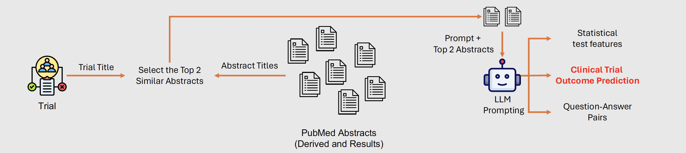

# LLM Predictions on PubMed Abstracts



## Prerequisites

- Download the trial dataset from CITI . If it has already been downloaded, provide the path to the data in the scripts.
- To extract all the PubMed abstracts linked to the clinical trials, we use the NCBI API. Follow instructions at this [page](https://support.nlm.nih.gov/knowledgebase/article/KA-05317/en-us) to create a NCBI account and obtain the API key.

## 1. Extract PubMed Abstracts

- Run the following commands for the extraction algorithm to retrieve all linked PubMed abstracts. Provide the NCBI API key, the path to the CITI data and the path to save the extracted abstracts.

```jsx
cd llm_prediction_on_pubmed
python extract_pubmed_abstracts.py --data_path <Path to CITI data> --NCBI_api_key <API key> --save_path <Path to save extracted abstracts>
```

## 2. Retrieve Top 2 Abstracts

- In order to have the process efficient, we initially retrieve top 2 most relevant abstracts (as shown in the figure above) and save them in a dataframe.

```jsx
python retrieve_top2_abstracts.py --data_path <Path to CITI data> --pubmed_path <Path to the extracted pubmed data>
```

The resultant dataframe will be save at /<pubmed_path>/top_2_extracted_pubmed_articles.csv

## 3. Get LLM Predictions

- To get the llm prediction on PubMed abstracts, provide the OpenAI api key to get_llm_predictions.py script and run the following. Also provide the path to the above top_2_extracted_pubmed_articles.csv and the path to save llm predictions

```jsx
python get_llm_predictions.py --top_2_pubmed_path <Path to top_2_extracted_pubmed_articles.csv> --save_path <Path to save LLM predictions>
```

- Finally to combine all the outcomes run the following code. Also provide the path to the above top_2_extracted_pubmed_articles.csv and the path to saved llm predictions.

```jsx
python clean_and_extract_final_outcomes.py --gpt_decisions_path <Path to saved LLM predictions> --top_2_pubmed_path <Path to top_2_extracted_pubmed_articles.csv>
```

- Final outcome predictions from LLM saved in <top_2_pubmed_path>/pubmed_gpt_outcomes.csv